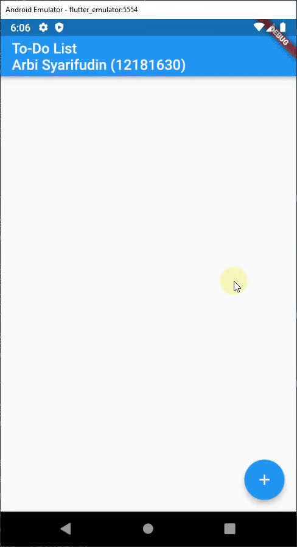

# Todo App Sederhana with Flutter

## UAS Mobile Programming
Oleh: Arbi Syarifudin (12181630)
m
___

## Hasil :

## PENJELASAN [lib/main.dart](lib/main.dart):
1. Pada fungsi `build` kita menambah sebuah ListView Widget untuk mengisi bagian `Scaffold` . ListView terdiri dari properti `children` yang mengambil list widget sebagai nilainya
2. Fungsi `getItems` memperulangkan daftar `title` (task/tugas melalui) `List<String>_todoList` dan membuat sebuah ListTile widget untuk setiap `title` task/tugas. Hasilnya dia akan menampilkan list ke dalam `ListView`

> Fungsi ini akan dipanggil setiap kali state mengalami perubahan dan widget dibuat ulang

3. Kita menggunakan `Floating Action Button` untuk menangani fungsionalitas penambahan item ke dalam to-do list
4. Ia akan memanggil fungsi `_displayDialog` yang akan menampilkan pop-up dialog beserta sebuah input teks kepada pengguna untuk diinputkan nama tugas/task yang ingin ditambahkan ke dalam `_todoList`
5. To do this we need to call the showDialog function which alters the apps state to show a dialog. It takes two parameters context and itembuilder. We pass in the BuildContext from the build function, and AlertDialog to the item builder parameter.
6. Untuk melakukan ini kita perlu memanggil fungsi `showDialog` yang akan mengubah state dan menjadikan dialog pop-up muncul. Fungsi ini membutuhkan 2 parameter: `context` dan `itembuilder`. Kita melemparkan `BuildContext` dari fungsi `build`, dan `AlertDialog` dari parameter item builder.
7. ``itemBuilder`` must return a type of AlertDialog and there are many variations but we will be using a simple AlertDialog, with a title and content parameter. For the content, I am passing in a text field with a TextEditingController to listen to and store the values of the editable text field. I also added action widgets CANCEL and ADD. When we cancel we pop the dialog off the stack to remove the overlay and return to the original screen.
8. `itemBuilder` akan me-return  `AlertDialog`. Kita memasang  `TextEditingController` listener ke dalam inputan teks dan akan menyimpan nilai yang diinputkan oleh pengguna. Tambahkan juga tombol `BATAL` dan `TAMBAH`. Ketika tombol batal, dialog pop-up akan hilang.
9. Ketika tombol tambah di klik, maka item tugas akan di masukan ke dalam data list. Bungkus dengan fungsi setState agar aplikasi mengetahui bahwa ada perubahan pada state dan akan melakukan rebuild widget.
10. Untuk dialog EDIT dan HAPUS logikanya mirip dengan yang dialog TAMBAH. Bedanya ketika dialog Edit muncul dia akan menampilkan tugas yang sedang di edit, dan ketika tombol HAPUS di tekan, dia akan menghapus data tersebut dari list datas.
